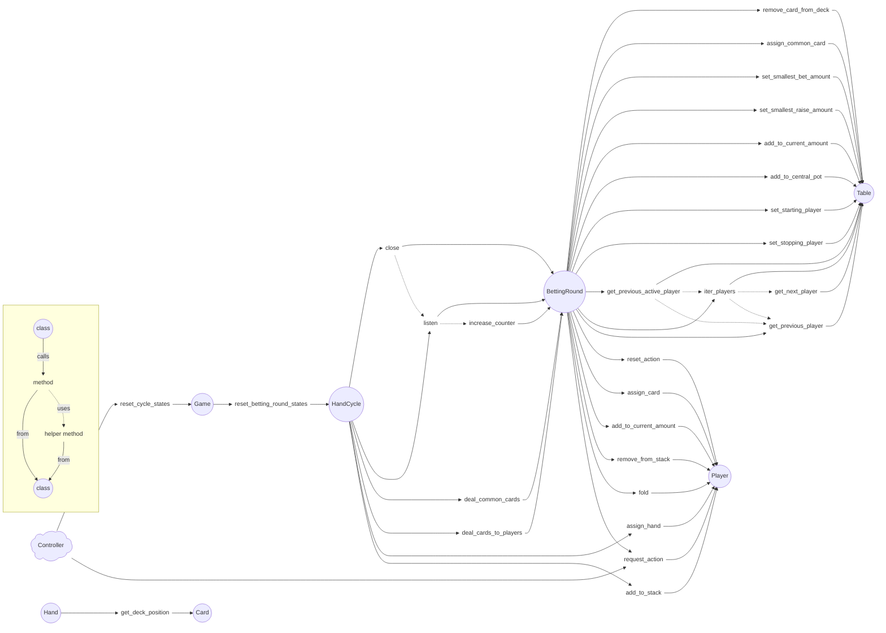

```mermaid
flowchart LR


    %% Legend

    subgraph " "
        i1(class)@{ shape: circle }
        i2(class)@{ shape: circle }
        m1(method)@{ shape: text }
        m2(helper method)@{ shape: text }
        i1 --> |calls| m1
        m1 --> |from| i2
        m1 -.-> |uses| m2
        m2 --> |from| i2
    end


    %% Classes and methods

    G(Game)@{ shape: circle }
    G.reset_cycle_states(reset_cycle_states)@{ shape: text }

    HC(HandCycle)@{ shape: circle }
    HC.reset_betting_round_states(reset_betting_round_states)@{ shape: text }

    BR(BettingRound)@{ shape: circle }
    BR.listen(listen)@{ shape: text }
    BR.close(close)@{ shape: text }
    BR.increase_counter(increase_counter)@{ shape: text }
    BR.deal_cards_to_players(deal_cards_to_players)@{ shape: text }
    BR.deal_common_cards(deal_common_cards)@{ shape: text }

    T(Table)@{ shape: circle }
    T.remove_card_from_deck(remove_card_from_deck)@{ shape: text }
    T.assign_common_card(assign_common_card)@{ shape: text }
    T.set_smallest_bet_amount(set_smallest_bet_amount)@{ shape: text }
    T.set_smallest_raise_amount(set_smallest_raise_amount)@{ shape: text }
    T.add_to_current_amount(add_to_current_amount)@{ shape: text }
    T.add_to_central_pot(add_to_central_pot)@{ shape: text }
    T.set_starting_player(set_starting_player)@{ shape: text }
    T.set_stopping_player(set_stopping_player)@{ shape: text }
    T.get_previous_player(get_previous_player)@{ shape: text }
    T.get_next_player(get_next_player)@{ shape: text }
    T.iter_players(iter_players)@{ shape: text }
    T.get_previous_active_player(get_previous_active_player)@{ shape: text }

    C(Controller)@{ shape: cloud }

    P(Player)@{ shape: circle }
    P.request_action(request_action)@{ shape: text }
    P.reset_action(reset_action)@{ shape: text }
    P.assign_card(assign_card)@{ shape: text }
    P.assign_hand(assign_hand)@{ shape: text }
    P.add_to_current_amount(add_to_current_amount)@{ shape: text }
    P.add_to_stack(add_to_stack)@{ shape: text }
    P.remove_from_stack(remove_from_stack)@{ shape: text }
    P.fold(fold)@{ shape: text }

    H(Hand)@{ shape: circle }

    Cd(Card)@{ shape: circle }
    Cd.get_deck_position(get_deck_position)@{ shape: text }


    %% Relations from Controller


    C --> G.reset_cycle_states --> G
    C --> P.request_action


    %% Relations from Game


    G --> HC.reset_betting_round_states --> HC


    %% Relations from HandCycle


    HC --> BR.close --> BR
           BR.close -.-> BR.listen --> BR

    HC --> BR.listen -.-> BR.increase_counter  --> BR

    HC --> BR.deal_common_cards -->  BR

    HC --> BR.deal_cards_to_players -->  BR

    HC --> P.assign_hand --> P

    HC --> P.add_to_stack --> P


    %% Relations from BettingRound


    BR --> T.remove_card_from_deck --> T

    BR --> T.assign_common_card --> T

    BR --> T.set_smallest_bet_amount --> T

    BR --> T.set_smallest_raise_amount --> T

    BR --> T.add_to_current_amount --> T

    BR --> T.add_to_central_pot --> T

    BR --> T.set_starting_player --> T

    BR --> T.set_stopping_player --> T

    BR --> T.get_previous_active_player --> T
           T.get_previous_active_player -.-> T.iter_players --> T
           T.get_previous_active_player -.-> T.get_previous_player --> T

    BR --> T.iter_players -.-> T.get_next_player --> T
           T.iter_players -.-> T.get_previous_player

    BR --> T.get_previous_player

    BR --> P.reset_action --> P

    BR --> P.assign_card --> P

    BR --> P.add_to_current_amount --> P
    BR --> P.remove_from_stack --> P
    BR --> P.fold --> P
    BR --> P.request_action --> P


    %% Relations from Hand


    H --> Cd.get_deck_position --> Cd
```
