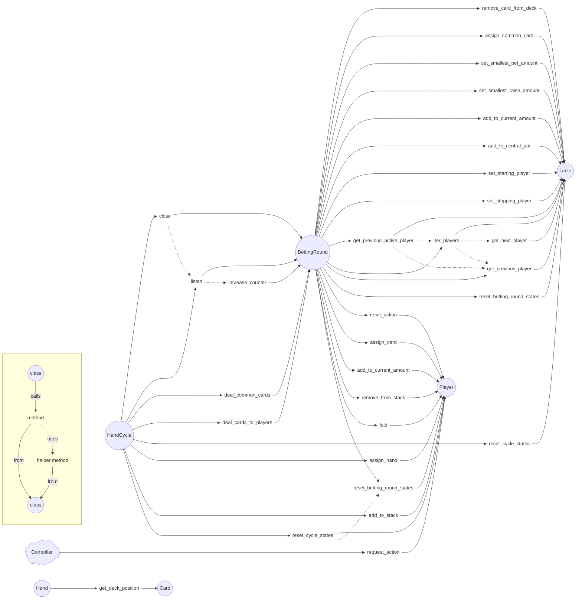

```mermaid
flowchart LR

    %% Legend

    subgraph " "
        i1(class)@{ shape: circle }
        i2(class)@{ shape: circle }
        m1(method)@{ shape: text }
        m2(helper method)@{ shape: text }
        i1 --> |calls| m1
        m1 --> |from| i2
        m1 -.-> |uses| m2
        m2 --> |from| i2
    end

    %% Classes and methods

    C(Controller)@{ shape: cloud }

    HC(HandCycle)@{ shape: circle }

    BR(BettingRound)@{ shape: circle }
    BR.listen(listen)@{ shape: text }
    BR.close(close)@{ shape: text }
    BR.increase_counter(increase_counter)@{ shape: text }
    BR.deal_cards_to_players(deal_cards_to_players)@{ shape: text }
    BR.deal_common_cards(deal_common_cards)@{ shape: text }

    T(Table)@{ shape: circle }
    T.remove_card_from_deck(remove_card_from_deck)@{ shape: text }
    T.assign_common_card(assign_common_card)@{ shape: text }
    T.set_smallest_bet_amount(set_smallest_bet_amount)@{ shape: text }
    T.set_smallest_raise_amount(set_smallest_raise_amount)@{ shape: text }
    T.add_to_current_amount(add_to_current_amount)@{ shape: text }
    T.add_to_central_pot(add_to_central_pot)@{ shape: text }
    T.set_starting_player(set_starting_player)@{ shape: text }
    T.set_stopping_player(set_stopping_player)@{ shape: text }
    T.get_previous_player(get_previous_player)@{ shape: text }
    T.get_next_player(get_next_player)@{ shape: text }
    T.iter_players(iter_players)@{ shape: text }
    T.get_previous_active_player(get_previous_active_player)@{ shape: text }
    T.reset_betting_round_states(reset_betting_round_states)@{ shape: text }
    T.reset_cycle_states(reset_cycle_states)@{ shape: text }

    P(Player)@{ shape: circle }
    P.request_action(request_action)@{ shape: text }
    P.reset_action(reset_action)@{ shape: text }
    P.assign_card(assign_card)@{ shape: text }
    P.assign_hand(assign_hand)@{ shape: text }
    P.add_to_current_amount(add_to_current_amount)@{ shape: text }
    P.add_to_stack(add_to_stack)@{ shape: text }
    P.remove_from_stack(remove_from_stack)@{ shape: text }
    P.fold(fold)@{ shape: text }
    P.reset_betting_round_states(reset_betting_round_states)@{ shape: text }
    P.reset_cycle_states(reset_cycle_states)@{ shape: text }

    H(Hand)@{ shape: circle }

    Cd(Card)@{ shape: circle }
    Cd.get_deck_position(get_deck_position)@{ shape: text }

    %% HandCycle to BettingRound relations


    HC --> BR.close -->  BR


    HC --> BR.listen
    BR.close -.-> BR.listen
        BR.listen --> BR
        BR.listen -.-> BR.increase_counter --> BR

    HC --> BR.deal_common_cards -->  BR


    HC --> BR.deal_cards_to_players -->  BR


        BR --> T.remove_card_from_deck --> T

        BR --> T.assign_common_card --> T

        BR --> T.set_smallest_bet_amount --> T

        BR --> T.set_smallest_raise_amount --> T

        BR --> T.add_to_current_amount --> T

        BR --> T.add_to_central_pot --> T

        BR --> T.set_starting_player --> T

        BR --> T.set_stopping_player --> T

        BR --> T.get_previous_active_player --> T

        BR --> T.iter_players
        T.get_previous_active_player -.-> T.iter_players
            T.iter_players --> T
            T.iter_players -.-> T.get_next_player --> T

        BR --> T.get_previous_player
        T.get_previous_active_player -.-> T.get_previous_player
        T.iter_players -.-> T.get_previous_player
            T.get_previous_player --> T

        BR --> T.reset_betting_round_states --> T


    T.reset_cycle_states --> T

    P.request_action --> P
    P.reset_action --> P
    P.assign_card --> P
    P.assign_hand --> P
    P.add_to_current_amount --> P
    P.add_to_stack --> P
    P.remove_from_stack --> P
    P.fold --> P
    P.reset_betting_round_states --> P
    P.reset_cycle_states --> P

    Cd.get_deck_position --> Cd

    %% Class-method

    C -------> P.request_action

    HC --> T.reset_cycle_states

    HC --> P.assign_hand
    HC --> P.add_to_stack
    HC --> P.reset_cycle_states


    BR --> P.reset_action
    BR --> P.assign_card
    BR --> P.add_to_current_amount
    BR --> P.remove_from_stack
    BR --> P.fold
    BR --> P.reset_betting_round_states

    H --> Cd.get_deck_position

    %% Helper method relations

    P.reset_cycle_states -.-> P.reset_betting_round_states


    %%T.reset_betting_round_states -.-> T.get_previous_player


```