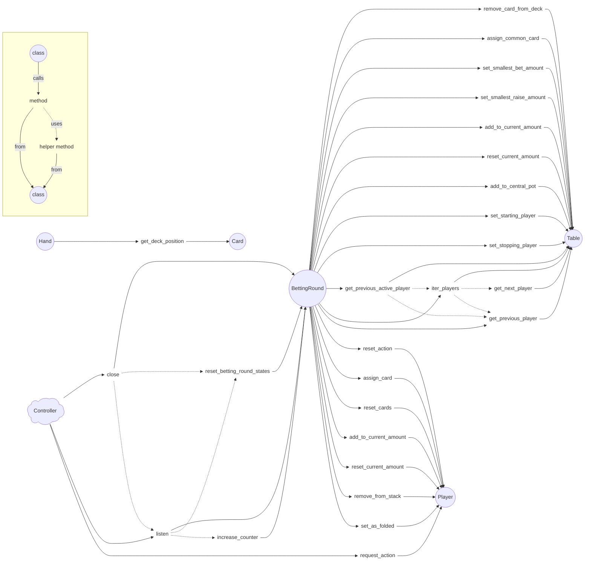

```mermaid
flowchart LR


    %% Legend

    subgraph " "
        i1(class)@{ shape: circle }
        i2(class)@{ shape: circle }
        m1(method)@{ shape: text }
        m2(helper method)@{ shape: text }
        i1 --> |calls| m1
        m1 --> |from| i2
        m1 -.-> |uses| m2
        m2 --> |from| i2
    end


    %% Classes and methods
    
    BR(BettingRound)@{ shape: circle }
    BR.close(close)@{ shape: text } -->  BR
    BR.listen(listen)@{ shape: text } -->  BR
    BR.reset_betting_round_states(reset_betting_round_states)@{ shape: text } -->  BR
    BR.increase_counter(increase_counter)@{ shape: text } -->  BR

    T(Table)@{ shape: circle }
    T.remove_card_from_deck(remove_card_from_deck)@{ shape: text } --> T
    T.assign_common_card(assign_common_card)@{ shape: text } --> T
    T.set_smallest_bet_amount(set_smallest_bet_amount)@{ shape: text } --> T
    T.set_smallest_raise_amount(set_smallest_raise_amount)@{ shape: text } --> T
    T.add_to_current_amount(add_to_current_amount)@{ shape: text } --> T
    T.reset_current_amount(reset_current_amount)@{ shape: text } --> T
    T.add_to_central_pot(add_to_central_pot)@{ shape: text } --> T
    T.set_starting_player(set_starting_player)@{ shape: text } --> T
    T.set_stopping_player(set_stopping_player)@{ shape: text } --> T
    T.get_previous_player(get_previous_player)@{ shape: text } --> T
    T.get_next_player(get_next_player)@{ shape: text } --> T
    T.iter_players(iter_players)@{ shape: text } --> T
    T.get_previous_active_player(get_previous_active_player)@{ shape: text } --> T

    C(Controller)@{ shape: cloud }

    P(Player)@{ shape: circle }
    P.request_action(request_action)@{ shape: text } --> P
    P.reset_action(reset_action)@{ shape: text } --> P
    P.assign_card(assign_card)@{ shape: text } --> P
    P.reset_cards(reset_cards)@{ shape: text } --> P
    P.add_to_current_amount(add_to_current_amount)@{ shape: text } --> P
    P.reset_current_amount(reset_current_amount)@{ shape: text } --> P
    P.remove_from_stack(remove_from_stack)@{ shape: text } --> P
    P.set_as_folded(set_as_folded)@{ shape: text } --> P

    H(Hand)@{ shape: circle }

    Cd(Card)@{ shape: circle }
    Cd.get_deck_position(get_deck_position)@{ shape: text } --> Cd


    %% Class to method relations

    C --> BR.close
    C --> BR.listen
    C --> P.request_action

    BR --> T.remove_card_from_deck
    BR --> T.assign_common_card
    BR --> T.set_smallest_bet_amount
    BR --> T.set_smallest_raise_amount
    BR --> T.add_to_current_amount
    BR --> T.reset_current_amount
    BR --> T.add_to_central_pot
    BR --> T.set_starting_player
    BR --> T.set_stopping_player
    BR --> T.get_previous_active_player
    BR --> T.iter_players
    BR --> T.get_previous_player
    BR --> P.reset_action
    BR --> P.assign_card
    BR --> P.reset_cards
    BR --> P.add_to_current_amount
    BR --> P.reset_current_amount
    BR --> P.remove_from_stack
    BR --> P.set_as_folded

    H ---> Cd.get_deck_position


    %% Helper method relations

    BR.close -.-> BR.reset_betting_round_states
    BR.close -.-> BR.listen

    BR.listen -.-> BR.reset_betting_round_states
    BR.listen -.-> BR.increase_counter

    T.get_previous_active_player -.-> T.iter_players
    T.get_previous_active_player -.-> T.get_previous_player

    T.iter_players -.-> T.get_next_player
    T.iter_players -.-> T.get_previous_player
```
