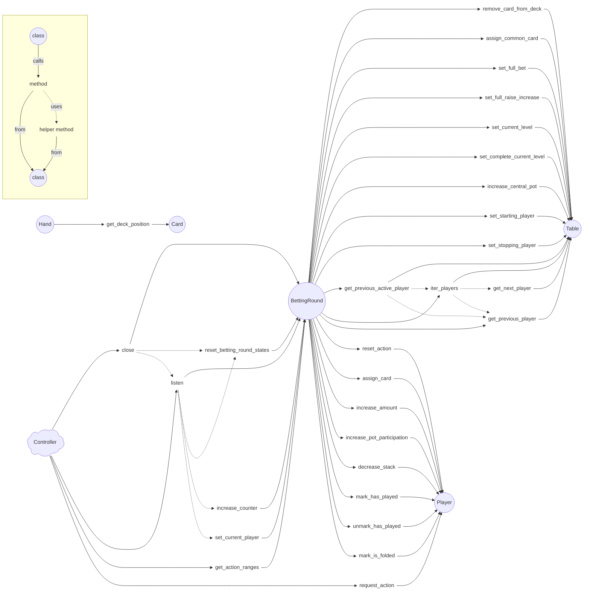

# Properties of structures

### Card (`Card`)

- **Value (`value`):** Rank of the card (numbers from 2 to 10, jacks, queens, kings and aces).

- **Suit (`suit`):** Symbol paired with the value (clubs, diamonds, hearts and spades).

### Hand (`Hand`)

- **Cards (`cards`):** Set of five cards that make up the hand.

- **Category (`category`):** Rank of the hand (high card, pair, two pair, three of a kind, straight, flush, full house, four of a kind, straight flush and royal flush).

### Action (`Action`)

- **Category (`category`):** Name of the action (fold, check, call, bet and raise).

- **Amount (`amount`):** Amount of chips placed in front during the action.

### Player (`Player`)

- **Name (`name`):** Player's identifier, unique within the table.

- **Cards (`cards`):** Cards dealt to the player.

- **Hand (`hand`):** Hand the player holds, according to the game rules.

- **Requested action (`requested_action`):** Action the player has requested in a betting round.

- **Stack (`stack`):** Chips the player has available to play.

- **Amount (`amount`):** Amount of chips the player has placed in front during the current betting round.

- **Pot participation (`pot_participation`):** Total amount of chips the player has placed in the pot during the current hand cycle.

- **Is folded (`is_folded`):** Whether the player has already folded in the current hand cycle.

- **Has played (`has_played`):** Whether the player has already taken a voluntary action during the current betting round (not including forced bets).

### Table (`Table`)

- **Deck (`deck`):** Cards still available to be dealt.

- **Common cards (`common_cards`):** Cards dealt as common to all players.

- **Players (`players`):** Players sitting at the table, in their respective order.

- **Participating players (`participating_players`):** Players still playing for the pot during a hand cycle.

- **Active players (`active_players`):** Players still playing for the pot and not all-in during a hand cycle.

- **Starting player (`starting_player`):** Player who acts first in the betting round. Defaults to the first player in the players list.

- **Stopping player (`stopping_player`):** Player who acts last in the betting round. This may be updated during the betting round, depending on the actions taken by other players. Defaults to the player before the starting player.

- **Current player (`current_player`):** Player who is being awaited to play. Defaults to the starting player.

- **Amount level (`amount_level`):** Largest amount of chips a player has placed in front during the current betting round, which other players must match in order to call.

- **Full bet (`full_bet`):** Minimum amount to bet.

- **Full amount level (`full_amount_level`):** Part of the amount level considered a full bet or raise. It may be smaller than a full bet when a player goes all-in for less. In that case, other players can complete the full bet (in addition to folding, calling or raising).

- **Full raise increase (`full_raise_increase`):** Minimum amount by which to increase the full amount level.

- **Pot (`pot`):** Total amount of chips being played for in the betting round.

- **Split pot (`split_pot`):** Pot split into main pot and side pots.

# Properties of engines

### Betting round (`BettingRound`)

- **Name (`name`):** Betting round's identifier, unique within the hand cycle.

- **Table (`table`):** Table in which the betting round takes place.

- **Lap counts (`lap_counts`):** Number of times the action passes through the starting player (even if folded or all-in).

- **Open fold allowed (`open_fold_allowed`):** *[modifiable]* Whether folding is allowed when there is no bet or raise to respond to.

- **Is completed (`is_completed`):** Whether the betting round already ended.

- **Raise invalid actions (`raise_invalid_actions`):** Whether an exception should be raised when an invalid action is chosen, or the player should be prompted again.

# Communication model

